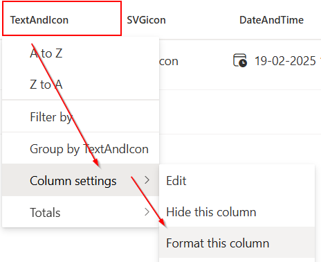
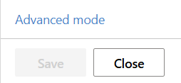

# SharePoint-formatting
A collection of SharePoint formatting.

## How to

**Change the formatting for a column**

1. Click on the column and go to **Column settings** > **Format this column**

2. Click on **advanced mode** 

3. Replace the entire JSON code from the samples
