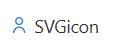

# SVG icon

## Image


## Summary
Add an SVG icon before a text

## Column Types
- Single line of text
- Single choice

## How To
**Change the icon for _single_ path icons**

1. Browse available icons at https://www.flaticon.com/ or similar who provides SVG files.
2. Open the SVG file in a code editor (Notepad or Visual Studio Code)
3. The code will look something like this

```xml
<?xml version="1.0" encoding="UTF-8"?>
<svg xmlns="http://www.w3.org/2000/svg"
     id="Layer_1"
     data-name="Layer 1"
     viewBox="0 0 24 24"
     width="512"
     height="512">

  <path d="
m12,0
C6.486,0,2,4.432,2,9.88
c0,5.184,4.58,10.39,7.311,13.033
.754.729,1.722,1.094,2.689,1.094
s1.936-.365,2.689-1.094
c2.73-2.643,7.311-7.849,7.311-13.033
C22,4.432,17.514,0,12,0
Zm1.299,21.475
c-.729.704-1.869.704-2.598,0
-2.502-2.422-6.701-7.149-6.701-11.595
0-4.345,3.589-7.88,8-7.88
s8,3.535,8,7.88
c0,4.446-4.199,9.173-6.701,11.595
Zm4.699-12.362
c-.054.905-.27,2.152-1.002,2.883
-.732.732-1.978.948-2.883,1.002
-.628.037-1.148-.482-1.111-1.111
.054-.905.27-2.152,1.002-2.883
.732-.732,1.978-.948,2.883-1.002
.628-.037,1.148.482,1.111,1.111
Zm-7,2.775
c.037.628-.482,1.148-1.111,1.111
-.905-.054-2.152-.27-2.883-1.002
-.732-.732-.948-1.978-1.002-2.883
-.037-.628.482-1.148,1.111-1.111
.905.054,2.152.27,2.883,1.002
.732.732.948,1.978,1.002,2.883
  "/>
</svg>
```

4. Copy the code path ```<m12,0
C6.486,0,2,4.432,2,9.88...>```

5. Replace the code inside **"d"** property of [svg-icon-single-path.json](/column-samples/SVG-icon/svg-icon-single-path.json)

**Change the icon for _multi_ path icons**

1. You've found a icon that contains multiple path's

```
<?xml version="1.0" encoding="UTF-8"?>
<svg xmlns="http://www.w3.org/2000/svg" id="Outline" viewBox="0 0 24 24" width="512" height="512">
<path d="M12,12A6,6,0,1,0,6,6,6.006,6.006,0,0,0,12,12ZM12,2A4,4,0,1,1,8,6,4,4,0,0,1,12,2Z"/>
<path d="M12,14a9.01,9.01,0,0,0-9,9,1,1,0,0,0,2,0,7,7,0,0,1,14,0,1,1,0,0,0,2,0A9.01,9.01,0,0,0,12,14Z"/></svg>
```

2. Replace the code inside each **"d"** property of [svg-icon-multi-path.json](/column-samples/SVG-icon/svg-icon-multi-path.json)

3. Add more paths if nessesary