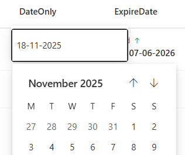

# Inline editing

## Image


## Summary
A column can be directly edited without opening the details pane.

## Column Types
- All

## How To
**Use in other formatting**

The inline editing can be added to any type of formatting by adding the **inlineEditField** property.

```
  "$schema": "https://developer.microsoft.com/json-schemas/sp/v2/column-formatting.schema.json",
  "elmType": "div",
  "inlineEditField": "@currentField",
```

In the [inline-editing-other-example](inline-editing-other-example.json) the [date formatting](/column-samples/date/) has been changed to an inline editing field

